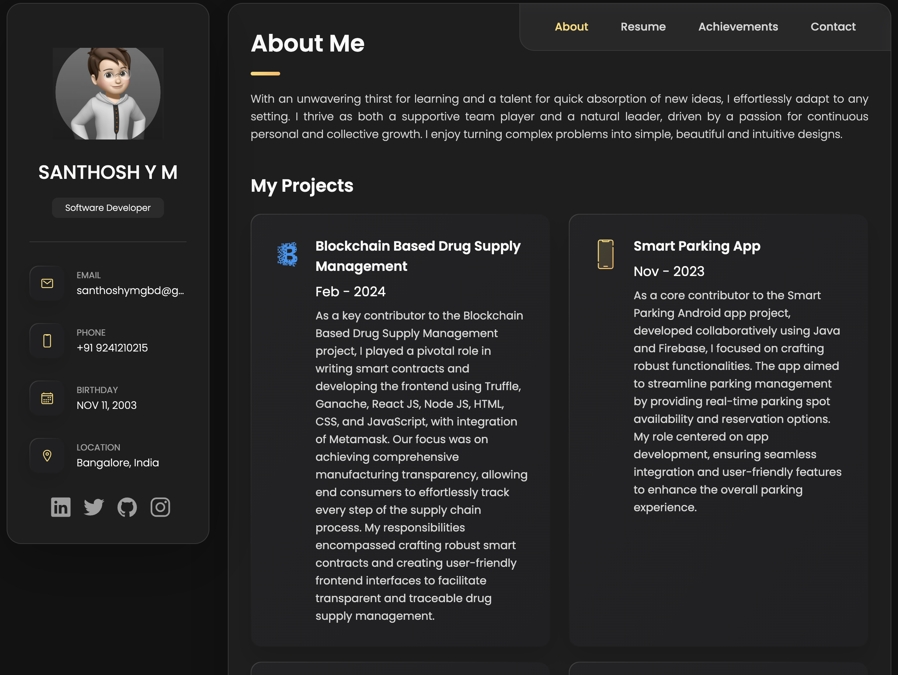

# Portfolio-Website

This is a Personal portfolio with a Simple and Attracting profile with using HTML, CSS, and Javascript.

## Demo




## Prerequisites

Before you begin, ensure you have met the following requirements:

* [Git](https://git-scm.com/downloads "Download Git") must be installed on your operating system.

## Installing Portfolio

To install **Portfolio**, follow these steps:

Linux and macOS:

```bash
sudo git clone https://github.com/ymsanthosh/Portfolio-Website.git
```

Windows:

```bash
git clone https://github.com/ymsanthosh/Portfolio-Website.git
```
# Thank You
